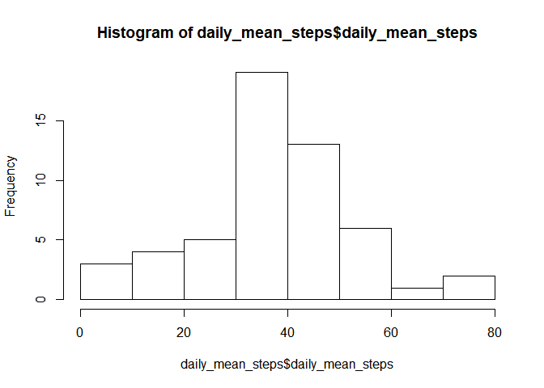

I am going to need tidyverse so just loading that up here.


```r
library(tidyverse)
```

```
## -- Attaching packages -------------------------------------------------------------------------------- tidyverse 1.2.1 --
```

```
## v ggplot2 3.1.1     v purrr   0.3.2
## v tibble  2.1.1     v dplyr   0.8.1
## v tidyr   0.8.3     v stringr 1.4.0
## v readr   1.3.1     v forcats 0.4.0
```

```
## -- Conflicts ----------------------------------------------------------------------------------- tidyverse_conflicts() --
## x dplyr::filter() masks stats::filter()
## x dplyr::lag()    masks stats::lag()
```

## Loading and preprocessing the data

The problem states

>The variables included in this dataset are:<br>
>steps: Number of steps taking in a 5-minute interval (missing values are coded as NA)<br>
>date: The date on which the measurement was taken in YYYY-MM-DD format<br>
>interval: Identifier for the 5-minute interval in which measurement was taken<br>
>The dataset is stored in a comma-separated-value (CSV) file and there are a total of 17,568 >observations in this dataset.


```r
activity = read_csv('activity/activity.csv', col_types = cols(
  steps = col_double(),
  date = col_date(),
  interval = col_integer()
))
head(activity)
```

```
## # A tibble: 6 x 3
##   steps date       interval
##   <dbl> <date>        <int>
## 1    NA 2012-10-01        0
## 2    NA 2012-10-01        5
## 3    NA 2012-10-01       10
## 4    NA 2012-10-01       15
## 5    NA 2012-10-01       20
## 6    NA 2012-10-01       25
```

```r
summary(activity)
```

```
##      steps             date               interval     
##  Min.   :  0.00   Min.   :2012-10-01   Min.   :   0.0  
##  1st Qu.:  0.00   1st Qu.:2012-10-16   1st Qu.: 588.8  
##  Median :  0.00   Median :2012-10-31   Median :1177.5  
##  Mean   : 37.38   Mean   :2012-10-31   Mean   :1177.5  
##  3rd Qu.: 12.00   3rd Qu.:2012-11-15   3rd Qu.:1766.2  
##  Max.   :806.00   Max.   :2012-11-30   Max.   :2355.0  
##  NA's   :2304
```

Looks sort of right. The steps are 0 a lot. Perhaps people are sleeping?

## What is mean total number of steps taken per day?


```r
all_daily_mean_steps = summarize(group_by(activity, date), mean_steps=mean(steps))
all_daily_mean_steps
```

```
## # A tibble: 61 x 2
##    date       mean_steps
##    <date>          <dbl>
##  1 2012-10-01     NA    
##  2 2012-10-02      0.438
##  3 2012-10-03     39.4  
##  4 2012-10-04     42.1  
##  5 2012-10-05     46.2  
##  6 2012-10-06     53.5  
##  7 2012-10-07     38.2  
##  8 2012-10-08     NA    
##  9 2012-10-09     44.5  
## 10 2012-10-10     34.4  
## # ... with 51 more rows
```

Those NAs are making me nervous, so let's drop them:

```r
activity_lite = drop_na(activity)
daily_mean_steps = summarize(group_by(activity_lite, date), daily_mean_steps=mean(steps))
daily_mean_steps
```

```
## # A tibble: 53 x 2
##    date       daily_mean_steps
##    <date>                <dbl>
##  1 2012-10-02            0.438
##  2 2012-10-03           39.4  
##  3 2012-10-04           42.1  
##  4 2012-10-05           46.2  
##  5 2012-10-06           53.5  
##  6 2012-10-07           38.2  
##  7 2012-10-09           44.5  
##  8 2012-10-10           34.4  
##  9 2012-10-11           35.8  
## 10 2012-10-12           60.4  
## # ... with 43 more rows
```

That looks better, so now I can just look at the average


```r
mean(daily_mean_steps$daily_mean_steps)
```

```
## [1] 37.3826
```


## What is the average daily activity pattern?

We already have this so let's just look at it.


```r
plot(daily_mean_steps, type="l")
```

<!-- -->

No, the question asked for steps over the time of day over all days.


```r
interval_mean_steps = summarize(group_by(activity_lite, interval), interval_mean_steps=mean(steps))
interval_mean_steps
```

```
## # A tibble: 288 x 2
##    interval interval_mean_steps
##       <int>               <dbl>
##  1        0              1.72  
##  2        5              0.340 
##  3       10              0.132 
##  4       15              0.151 
##  5       20              0.0755
##  6       25              2.09  
##  7       30              0.528 
##  8       35              0.868 
##  9       40              0     
## 10       45              1.47  
## # ... with 278 more rows
```

```r
plot(interval_mean_steps, type="l")
```

<!-- -->

Yikes, expected that to be a lot smoother.
However, the quiet time while the user sleeps and then that commute/run in the morning makes sense.

## Imputing missing values

We could replace the steps by the average for the day or the interval.
I can imagine that the interval is more important (you sleep at midnight whether or not you took a hike earlier)
Or we can just use the local information before and after to do a fill.
The problem with the local information is that it can change pretty sharply, so if most of the NAs are at night, and it stopped collecting during a walk, we don't want it to show the person walking all night.


```r
a = left_join(activity, interval_mean_steps, by = "interval")
a$steps[is.na(a$steps)] <- a$interval_mean_steps[is.na(a$steps)]
```

The original steps had a mean and median of:


```r
mean(activity_lite$steps)
```

```
## [1] 37.3826
```

```r
median(activity_lite$steps)
```

```
## [1] 0
```
And the modified one has a mean and median of:

```r
mean(a$steps)
```

```
## [1] 37.3826
```

```r
median(a$steps)
```

```
## [1] 0
```


```r
daily_mean_imputed_steps = summarize(group_by(a, date), daily_mean_imputed_steps=mean(steps))
hist(daily_mean_imputed_steps$daily_mean_imputed_steps)
```

<!-- -->

```r
hist(daily_mean_steps$daily_mean_steps)
```

<!-- -->

## Are there differences in activity patterns between weekdays and weekends?

Create the weekday:


```r
activity_lite$weekday = weekdays(activity_lite$date)
activity_lite
```

```
## # A tibble: 15,264 x 4
##    steps date       interval weekday
##    <dbl> <date>        <int> <chr>  
##  1     0 2012-10-02        0 Tuesday
##  2     0 2012-10-02        5 Tuesday
##  3     0 2012-10-02       10 Tuesday
##  4     0 2012-10-02       15 Tuesday
##  5     0 2012-10-02       20 Tuesday
##  6     0 2012-10-02       25 Tuesday
##  7     0 2012-10-02       30 Tuesday
##  8     0 2012-10-02       35 Tuesday
##  9     0 2012-10-02       40 Tuesday
## 10     0 2012-10-02       45 Tuesday
## # ... with 15,254 more rows
```

Create the weekend:


```r
activity_lite$weekend[grepl("Saturday|Sunday", activity_lite$weekday)]= ("Weekend")
```

```
## Warning: Unknown or uninitialised column: 'weekend'.
```

```r
activity_lite$weekend[!grepl("Saturday|Sunday", activity_lite$weekday)]=("Weekday")
activity_lite$weekend <- as.factor(activity_lite$weekend)
activity_lite
```

```
## # A tibble: 15,264 x 5
##    steps date       interval weekday weekend
##    <dbl> <date>        <int> <chr>   <fct>  
##  1     0 2012-10-02        0 Tuesday Weekday
##  2     0 2012-10-02        5 Tuesday Weekday
##  3     0 2012-10-02       10 Tuesday Weekday
##  4     0 2012-10-02       15 Tuesday Weekday
##  5     0 2012-10-02       20 Tuesday Weekday
##  6     0 2012-10-02       25 Tuesday Weekday
##  7     0 2012-10-02       30 Tuesday Weekday
##  8     0 2012-10-02       35 Tuesday Weekday
##  9     0 2012-10-02       40 Tuesday Weekday
## 10     0 2012-10-02       45 Tuesday Weekday
## # ... with 15,254 more rows
```


```r
interval_mean_steps_w = summarize(group_by(activity_lite, interval, weekend), interval_mean_steps=mean(steps))
plot(interval_mean_steps_w$interval_mean_steps[interval_mean_steps_w$weekend=="Weekend"], type="l")
```

<!-- -->

```r
plot(interval_mean_steps_w$interval_mean_steps[interval_mean_steps_w$weekend=="Weekday"], type="l")
```

<!-- -->
