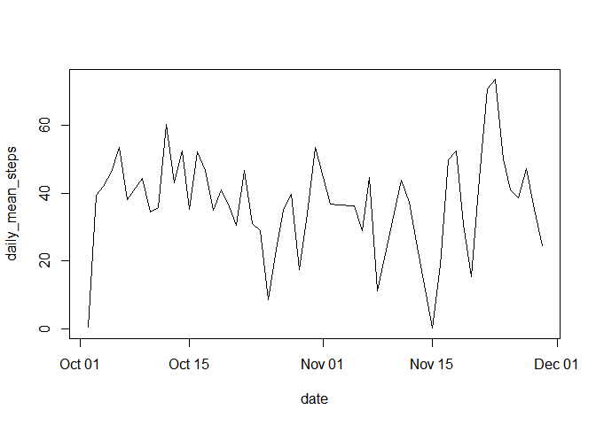

I am going to need tidyverse so just loading that up here.


```r
library(tidyverse)
```

```
## -- Attaching packages -------------------------------------------------------------------------------- tidyverse 1.2.1 --
```

```
## v ggplot2 3.1.1     v purrr   0.3.2
## v tibble  2.1.1     v dplyr   0.8.1
## v tidyr   0.8.3     v stringr 1.4.0
## v readr   1.3.1     v forcats 0.4.0
```

```
## -- Conflicts ----------------------------------------------------------------------------------- tidyverse_conflicts() --
## x dplyr::filter() masks stats::filter()
## x dplyr::lag()    masks stats::lag()
```

## Loading and preprocessing the data

The problem states

>The variables included in this dataset are:<br>
>steps: Number of steps taking in a 5-minute interval (missing values are coded as NA)<br>
>date: The date on which the measurement was taken in YYYY-MM-DD format<br>
>interval: Identifier for the 5-minute interval in which measurement was taken<br>
>The dataset is stored in a comma-separated-value (CSV) file and there are a total of 17,568 >observations in this dataset.


```r
activity = read.csv('activity/activity.csv')
head(activity)
```

```
##   steps       date interval
## 1    NA 2012-10-01        0
## 2    NA 2012-10-01        5
## 3    NA 2012-10-01       10
## 4    NA 2012-10-01       15
## 5    NA 2012-10-01       20
## 6    NA 2012-10-01       25
```

```r
summary(activity)
```

```
##      steps                date          interval     
##  Min.   :  0.00   2012-10-01:  288   Min.   :   0.0  
##  1st Qu.:  0.00   2012-10-02:  288   1st Qu.: 588.8  
##  Median :  0.00   2012-10-03:  288   Median :1177.5  
##  Mean   : 37.38   2012-10-04:  288   Mean   :1177.5  
##  3rd Qu.: 12.00   2012-10-05:  288   3rd Qu.:1766.2  
##  Max.   :806.00   2012-10-06:  288   Max.   :2355.0  
##  NA's   :2304     (Other)   :15840
```

Looks sort of right. The steps are 0 a lot. Perhaps people are sleeping?

## What is mean total number of steps taken per day?


```r
all_daily_mean_steps = summarize(group_by(activity, date), mean_steps=mean(steps))
all_daily_mean_steps
```

```
## # A tibble: 61 x 2
##    date       mean_steps
##    <fct>           <dbl>
##  1 2012-10-01     NA    
##  2 2012-10-02      0.438
##  3 2012-10-03     39.4  
##  4 2012-10-04     42.1  
##  5 2012-10-05     46.2  
##  6 2012-10-06     53.5  
##  7 2012-10-07     38.2  
##  8 2012-10-08     NA    
##  9 2012-10-09     44.5  
## 10 2012-10-10     34.4  
## # ... with 51 more rows
```

Those NAs are making me nervous, so let's drop them:

```r
activity_lite = drop_na(activity)
daily_mean_steps = summarize(group_by(activity_lite, date), daily_mean_steps=mean(steps))
daily_mean_steps
```

```
## # A tibble: 53 x 2
##    date       daily_mean_steps
##    <fct>                 <dbl>
##  1 2012-10-02            0.438
##  2 2012-10-03           39.4  
##  3 2012-10-04           42.1  
##  4 2012-10-05           46.2  
##  5 2012-10-06           53.5  
##  6 2012-10-07           38.2  
##  7 2012-10-09           44.5  
##  8 2012-10-10           34.4  
##  9 2012-10-11           35.8  
## 10 2012-10-12           60.4  
## # ... with 43 more rows
```

That looks better, so now I can just look at the average


```r
mean(daily_mean_steps$daily_mean_steps)
```

```
## [1] 37.3826
```


## What is the average daily activity pattern?

We already have this so let's just look at it.


```r
plot(daily_mean_steps)
```

<!-- -->


## Imputing missing values

We could replace each value by the mean of the steps, but we actually have the mean of the steps by _day_
We might as well use that information to replace each NA with the daily mean. 
Sometimes we don't have any steps for a day -- which is why we dropped them in the first place.
Those days can be replaced by the mean for all steps.

So to recap this will be a two step process:

* replace the NA within a day by the daily average.

* replace all remaining NAs (belonging to days with no readings) with the average steps for a day

We go back to the original:


## Are there differences in activity patterns between weekdays and weekends?
